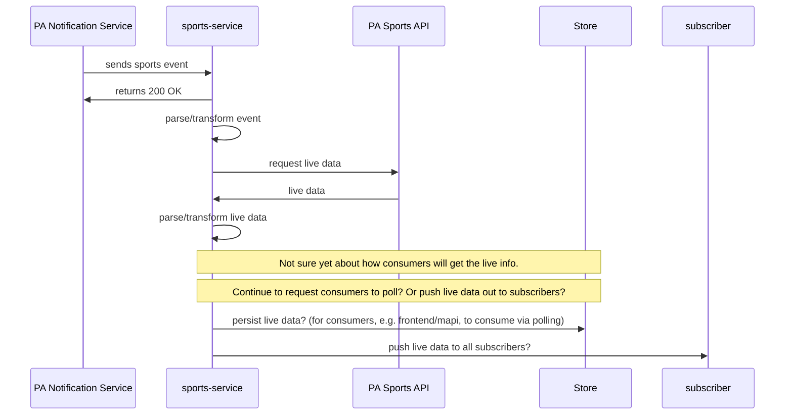

# sports-service #

Simple scalatra app to handle live sports event sent from PA.

## Build & Run ##

```sh
$ cd sports-service
$ sbt
> jetty:start
> browse
```

If `browse` doesn't launch your browser, manually open [http://localhost:8080/](http://localhost:8080/) in your browser.

## Ideas


